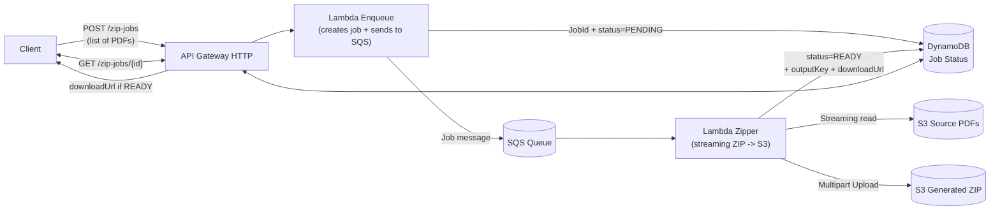

# S3 ZIP Jobs - Serverless PDF Archiving Service

A serverless AWS-based service that creates ZIP archives from PDF files stored in S3 buckets using **streaming processing** to handle large files without memory overflow.

## 🏗️ Architecture



### 🔄 Processing Flow

1. **Job Creation**: `POST /zip-jobs` receives a list of S3 object keys and creates a job in DynamoDB with `status=PENDING`, then publishes a message to SQS
2. **Streaming Processing**: The **Zipper Lambda** (SQS subscriber) reads each PDF from S3 **in streaming mode**, generates a ZIP using **zipstream-ng**, and uploads to S3 via **Multipart Upload**
3. **Completion**: Updates DynamoDB with `status=READY` and stores the `downloadUrl` (presigned URL)
4. **Status Check**: `GET /zip-jobs/{id}` returns the status and `downloadUrl` when available

### 🚀 Memory Optimization

- **Streaming S3 reads** (`iter_chunks`) and **streaming S3 writes** using **Multipart Upload**
- No `/tmp` or large `BytesIO` usage; fixed buffer size (8MB)
- Handles large file collections without memory overflow

## 📋 Requirements

- Terraform >= 1.5
- AWS CLI configured with appropriate permissions
- Python 3.11+ (for Lambda package dependencies)
- AWS account with sufficient permissions

## ⚙️ Configuration

### Main Terraform Variables

See `infra/variables.tf`. Key variables:

- `project_name` - Resource prefix (default: "s3-zip-jobs")
- `aws_region` - AWS region (default: "us-east-1")
- `src_bucket_name` - Source bucket for PDFs (required)
- `dst_bucket_name` - Destination bucket for ZIP files (required)
- `dst_prefix` - Destination prefix (default: "zips/")
- `presign_ttl_seconds` - Presigned URL TTL (default: 86400 = 24h)

### Environment Setup

1. Copy the environment template:
   ```bash
   cp scripts/env.example .env
   ```

2. Edit `.env` with your configuration:
   ```bash
   # S3 bucket names (must be globally unique)
   SRC_BUCKET=your-source-bucket-name
   DST_BUCKET=your-destination-bucket-name
   DST_PREFIX=zips/
   
   # API Gateway URL (filled after terraform apply)
   API_BASE=https://your-api-gateway-url.execute-api.us-east-1.amazonaws.com
   ```

## 🚀 Quick Start

```bash
# 1. Configure environment variables
cp scripts/env.example .env
# Edit .env with your bucket names

# 2. Build Lambda packages
make build

# 3. Deploy infrastructure (creates AWS resources)
make tf-init
make tf-apply

# 4. Upload test PDFs
scripts/upload_pdfs.sh examples/*.pdf

# 5. Test complete workflow
scripts/test_flow.sh
```

## 📡 API Endpoints

### Base URL
```
https://your-api-gateway-url.execute-api.us-east-1.amazonaws.com
```

### 1. Create ZIP Job
**POST** `/zip-jobs`

Creates a new ZIP job and returns a job ID for tracking.

**Request Body:**
```json
{
  "sourceBucket": "your-source-bucket",
  "targetBucket": "your-destination-bucket",
  "targetPrefix": "zips/",
  "keys": ["uploads/file1.pdf", "uploads/file2.pdf"]
}
```

**Response:**
```json
{
  "jobId": "12345678-1234-1234-1234-123456789abc",
  "status": "PENDING"
}
```

**cURL Example:**
```bash
curl -X POST https://your-api.execute-api.us-east-1.amazonaws.com/zip-jobs \
  -H "Content-Type: application/json" \
  -d '{
    "sourceBucket": "your-source-bucket",
    "targetBucket": "your-destination-bucket", 
    "targetPrefix": "zips/",
    "keys": ["uploads/test.pdf"]
  }'
```

### 2. Check Job Status
**GET** `/zip-jobs/{jobId}`

Returns the current status of a ZIP job.

**Response (PENDING):**
```json
{
  "jobId": "12345678-1234-1234-1234-123456789abc",
  "status": "PENDING"
}
```

**Response (READY):**
```json
{
  "jobId": "12345678-1234-1234-1234-123456789abc",
  "status": "READY",
  "downloadUrl": "https://s3.amazonaws.com/bucket/zips/file.zip?AWSAccessKeyId=...",
  "targetBucket": "your-destination-bucket",
  "targetKey": "zips/12345678-1234-1234-1234-123456789abc.zip"
}
```

**cURL Example:**
```bash
curl -X GET https://your-api.execute-api.us-east-1.amazonaws.com/zip-jobs/12345678-1234-1234-1234-123456789abc
```

**Download the ZIP:**
```bash
curl -O "https://s3.amazonaws.com/bucket/zips/file.zip?AWSAccessKeyId=..."
```

## 📁 Project Structure

- `infra/` - Terraform infrastructure for API Gateway HTTP, 3 Lambdas (enqueue/status/zipper), SQS, DynamoDB, S3, IAM, and CloudWatch (1-day retention)
- `lambdas/` - Lambda function code with CloudWatch logging
- `scripts/` - Helper scripts for PDF upload and end-to-end testing
- `Makefile` - Build/Deploy/Destroy and utility commands

## 🛠️ Available Scripts

### PDF Generation and Upload

```bash
# Generate 500 sample PDF files
scripts/generate_pdfs.sh 500

# Upload files to S3 with optimized settings
scripts/bulk_upload.sh --parallel 20 --batch 50 examples

# Generate and upload in one command
scripts/bulk_upload.sh --generate 500 --parallel 20 --batch 50
```

### Bulk Upload Options

- `--prefix PREFIX` - S3 prefix (default: `uploads/`)
- `--parallel NUM` - Number of parallel uploads (default: 10)
- `--batch NUM` - Batch size for processing (default: 50)
- `--generate NUM` - Generate NUM sample PDF files

### ZIP Creation and Testing

```bash
# Create ZIP with all PDFs from uploads/ prefix
scripts/test_flow.sh

# Create ZIP from specific prefix
scripts/test_flow.sh documents/

# Create ZIP from entire bucket
scripts/test_flow.sh ""

# Get help
scripts/test_flow.sh --help
```

## 💰 Cost Optimization

All services are configured with **minimal/on-demand** settings:
- DynamoDB on-demand pricing
- Standard SQS pricing
- Lambda with modest memory allocation
- Simple S3 buckets
- CloudWatch logs with **1-day retention**

## 🧹 Cleanup

```bash
# Remove all AWS resources (⚠️ destroys data in buckets)
make tf-destroy
```

## 📊 Complete Usage Example

```bash
# 1. Upload PDFs to S3 (using AWS CLI)
aws s3 cp document.pdf s3://your-source-bucket/uploads/

# 2. Create ZIP job
JOB_RESPONSE=$(curl -s -X POST https://your-api.execute-api.us-east-1.amazonaws.com/zip-jobs \
  -H "Content-Type: application/json" \
  -d '{
    "sourceBucket": "your-source-bucket",
    "targetBucket": "your-destination-bucket",
    "targetPrefix": "zips/",
    "keys": ["uploads/document.pdf"]
  }')

# 3. Extract job ID
JOB_ID=$(echo $JOB_RESPONSE | jq -r .jobId)
echo "Job created: $JOB_ID"

# 4. Wait for completion (polling)
while true; do
  STATUS_RESPONSE=$(curl -s https://your-api.execute-api.us-east-1.amazonaws.com/zip-jobs/$JOB_ID)
  STATUS=$(echo $STATUS_RESPONSE | jq -r .status)
  echo "Status: $STATUS"
  
  if [ "$STATUS" = "READY" ]; then
    DOWNLOAD_URL=$(echo $STATUS_RESPONSE | jq -r .downloadUrl)
    echo "Download URL: $DOWNLOAD_URL"
    curl -O "$DOWNLOAD_URL"
    break
  elif [ "$STATUS" = "PENDING" ]; then
    sleep 5
  else
    echo "Error: $STATUS_RESPONSE"
    break
  fi
done
```

## 🔧 Makefile Commands

```bash
# Build Lambda packages
make build

# Deploy infrastructure
make tf-init
make tf-apply

# Test workflow
make test-flow

# Generate sample PDFs
make generate-pdfs COUNT=500

# Bulk upload files
make bulk-upload ARGS="--generate 500"

# Clean up
make tf-destroy
```

## 🎯 Use Cases

- **Document Archiving**: Bundle multiple PDFs into organized archives
- **Batch Processing**: Handle large collections of documents efficiently
- **API Integration**: Integrate with existing systems via REST API
- **Cost-Effective Storage**: Compress and organize files for long-term storage
- **On-Demand Packaging**: Create ZIP files only when needed

## 🔍 Monitoring and Debugging

- **CloudWatch Logs**: All Lambda functions log to CloudWatch with 1-day retention
- **DynamoDB**: Job status tracking and metadata storage
- **SQS**: Reliable message queuing for job processing
- **S3**: Source files and generated ZIP archives

## Full File Streaming Logic Explanation

### Imports and Basic Setup

```python
import os
import json
import boto3
import logging
from zipstream import ZipStream  # zipstream-ng
from botocore.config import Config
from datetime import datetime, timezone, timedelta
```

- `os`: read environment variables and handle file paths.  
- `json`: decode/encode JSON messages (mainly for SQS).  
- `boto3`: official AWS SDK for Python (used for S3, DynamoDB, etc.).  
- `logging`: standard Python logging, integrated with AWS CloudWatch Logs.  
- `ZipStream`: from **zipstream-ng** package, allows **streaming ZIP creation** (no need to load entire files in memory).  
- `botocore.config.Config`: configure advanced boto3 client options (connection pooling, retries, etc.).  
- `datetime/...`: utilities for time (imported but not actually used here).  

```python
logger = logging.getLogger()
logger.setLevel(logging.INFO)
```
- Retrieves the root logger and sets log level to INFO (so INFO, WARNING, ERROR, CRITICAL messages are logged).

```python
s3 = boto3.client("s3", config=Config(max_pool_connections=50))
dynamodb = boto3.resource("dynamodb")
```
- Creates an S3 client with up to 50 pooled connections (avoids network bottlenecks).  
- Creates a high-level DynamoDB resource object.

```python
TABLE_NAME = os.environ["TABLE_NAME"]
table = dynamodb.Table(TABLE_NAME)
```
- Reads DynamoDB table name from environment variables.  
- Creates a `table` object to query/update items.

```python
S3_PART_SIZE = int(os.environ.get("S3_PART_SIZE", str(8 * 1024 * 1024)))  # 8 MB
DEFAULT_CHUNK = int(os.environ.get("S3_READ_CHUNK", str(1024 * 1024)))    # 1 MB
```
- Defines **multipart part size** (default 8 MB). All but the last part must be ≥ 5 MB.  
- Defines **read chunk size** for S3 streaming (default 1 MB).

---

### Streaming Objects from S3

```python
def s3_stream_object(bucket, key, chunk_size=DEFAULT_CHUNK):
    obj = s3.get_object(Bucket=bucket, Key=key)
    body = obj["Body"]
    for chunk in body.iter_chunks(chunk_size=chunk_size):
        if chunk:
            yield chunk
```
- Downloads an object from S3 as a `StreamingBody`.  
- Iterates over it in chunks (`iter_chunks`) instead of downloading everything at once.  
- Uses `yield` to make it a **generator**: chunks are produced lazily → memory stays low.

---

### Streaming ZIP Generator

```python
def zip_members_generator(src_bucket, keys):
    z = ZipStream(compress_type=0)  # PDFs are usually already compressed
    for key in keys:
        arcname = os.path.basename(key)
        logger.info("Adding to ZIP: %s", key)
        z.add(s3_stream_object(src_bucket, key), arcname)
    for data in z:
        yield data
```
- Creates a `ZipStream` object with **no compression** (PDFs are already compressed).  
- For each key:
  - `arcname = os.path.basename(key)`: keeps only the file name.  
  - Logs the file being added.  
  - `z.add(...)`: adds a generator (stream of bytes) into the ZIP.  
- Finally, iterates over `z` itself, which produces ZIP bytes in a streaming way.

---

### Multipart Upload from Iterator

```python
def multipart_upload_from_iter(target_bucket, target_key, data_iter, part_size=S3_PART_SIZE):
    mpu = s3.create_multipart_upload(Bucket=target_bucket, Key=target_key)
    upload_id = mpu["UploadId"]
    parts = []
    buf = bytearray()
    part_number = 1
```
- Starts a multipart upload.  
- Saves `upload_id` (needed to complete or abort).  
- Prepares an empty list of parts and a buffer.

```python
    try:
        for chunk in data_iter:
            buf += chunk
            while len(buf) >= part_size:
                to_send = bytes(buf[:part_size])
                resp = s3.upload_part(
                    Bucket=target_bucket, Key=target_key,
                    PartNumber=part_number, UploadId=upload_id, Body=to_send
                )
                parts.append({"ETag": resp["ETag"], "PartNumber": part_number})
                del buf[:part_size]
                part_number += 1
```
- Reads from the generator (`data_iter`).  
- Accumulates chunks in `buf` until it reaches the defined `part_size`.  
- Sends a part to S3 (`upload_part`).  
- Records the part’s `ETag` and part number.  
- Removes the sent bytes from the buffer.  
- Increments the part counter.

```python
        if buf:
            resp = s3.upload_part(
                Bucket=target_bucket, Key=target_key,
                PartNumber=part_number, UploadId=upload_id, Body=bytes(buf)
            )
            parts.append({"ETag": resp["ETag"], "PartNumber": part_number})
```
- Sends the **last part** (may be smaller than 5 MB).

```python
        s3.complete_multipart_upload(
            Bucket=target_bucket, Key=target_key,
            MultipartUpload={"Parts": parts}, UploadId=upload_id
        )
```
- Finalizes the multipart upload, telling S3 to assemble all parts.

```python
    except Exception as e:
        s3.abort_multipart_upload(Bucket=target_bucket, Key=target_key, UploadId=upload_id)
        raise
```
- If something goes wrong, aborts the upload (avoids leaving orphan parts in S3).  
- Re-raises the error for logging/handling.

---

### Generating a Presigned URL

```python
def generate_presigned_url(bucket, key, ttl_seconds=86400):
    return s3.generate_presigned_url(
        ClientMethod="get_object",
        Params={"Bucket": bucket, "Key": key},
        ExpiresIn=ttl_seconds
    )
```
- Creates a temporary download link valid for `ttl_seconds` (default 24h).  
- Anyone with the link can download the object without AWS credentials.

---

### Processing a Job

```python
def process_job(job_id):
    logger.info("Processing job %s", job_id)
    resp = table.get_item(Key={"jobId": job_id})
    item = resp.get("Item")
    if not item:
        logger.warning("Job %s not found", job_id)
        return
```
- Retrieves the DynamoDB record with that job ID.  
- If not found, logs a warning and exits.

```python
    if item["status"] == "READY":
        logger.info("Job %s already READY, nothing to do", job_id)
        return
```
- Ensures **idempotency**: if the job was already processed, skip.

```python
    src_bucket = item["sourceBucket"]
    keys = item["keys"]
    dst_bucket = item.get("targetBucket", src_bucket)
    dst_key = item["targetKey"]
    ttl = int(item.get("presignTtlSeconds", 86400))
```
- Reads job configuration: source bucket, files to zip, destination bucket, destination key, TTL for presigned URL.

```python
    zip_iter = zip_members_generator(src_bucket, keys)
    multipart_upload_from_iter(dst_bucket, dst_key, zip_iter)
    url = generate_presigned_url(dst_bucket, dst_key, ttl)
```
- Creates a streaming ZIP generator.  
- Streams the ZIP into S3 using multipart upload.  
- Generates a presigned URL.

```python
    table.update_item(
        Key={"jobId": job_id},
        UpdateExpression="SET #s=:s, downloadUrl=:u",
        ExpressionAttributeNames={"#s": "status"},
        ExpressionAttributeValues={":s": "READY", ":u": url}
    )
    logger.info("Job %s completed. ZIP at s3://%s/%s", job_id, dst_bucket, dst_key)
```
- Updates DynamoDB: sets status to `READY` and saves the download URL.  
- Uses `#s` alias because `status` can be a reserved word in DynamoDB.

---

### Lambda Handler (SQS Trigger)

```python
def lambda_handler(event, context):
    logger.info("SQS Event: %s", json.dumps(event))
    records = event.get("Records", [])
    for r in records:
        try:
            body = json.loads(r["body"])
            job_id = body["jobId"]
            process_job(job_id)
        except Exception:
            logger.exception("Failed to process message: %s", r.get("messageId"))
    return {"ok": True}
```
- Lambda is triggered by SQS. `event["Records"]` contains all messages in the batch.  
- For each message:
  - Parses the JSON body.  
  - Reads the `jobId`.  
  - Calls `process_job(jobId)`.  
- If processing fails, logs the exception but continues with the next message.  
- Returns `{"ok": True}`.

> **Important Note about SQS + Lambda**  
> If one message fails, this code still returns success for the entire batch, meaning the failed message is **deleted** from the queue. For safer handling, consider Partial Batch Response or batch size = 1.

#### Safer SQS Handling with Partial Batch Response (Example)

```python
def lambda_handler(event, context):
    logger.info("SQS Event: %s", json.dumps(event))
    failures = []
    for r in event.get("Records", []):
        try:
            body = json.loads(r["body"])
            process_job(body["jobId"])
        except Exception:
            logger.exception("Failed to process message: %s", r.get("messageId"))
            failures.append({"itemIdentifier": r["messageId"]})
    return {"batchItemFailures": failures}
```
- With **Report Batch Item Failures** enabled on the event source mapping, this makes SQS retry only failed messages.

---

### Key Concepts Recap

- **Generators (`yield`)**: produce data lazily → memory-efficient.  
- **Streaming ZIP (zipstream-ng)**: build a ZIP archive while reading sources, without temp files.  
- **S3 Multipart Upload**: required for large files, supports retries, max 10,000 parts, ≥5 MB per part (except last).  
- **Presigned URLs**: temporary links to access S3 objects without credentials.  
- **DynamoDB**: NoSQL database; `get_item` and `update_item` used here.  
- **Idempotency**: ensures repeated messages don’t duplicate work.  
- **Connection Pooling**: speeds up many S3 requests in a short time.  
- **CloudWatch Logging**: essential for debugging in Lambda.

---

### Why Memory Doesn’t Blow Up

- Files are streamed from S3 in 1 MB chunks.  
- The ZIP is generated in streaming mode, not stored in memory.  
- Multipart upload buffers only up to 8 MB before sending a part.  
- Peak memory ≈ 8–16 MB, safe for AWS Lambda.

---

### Limits and Considerations

- **Duplicate names**: using `os.path.basename(key)` can cause collisions if different paths have the same filename.  
- **Multipart limits**: max 10,000 parts → ~80 GB limit with 8 MB parts. Increase part size if needed.  
- **Error handling**: currently aborts the multipart but doesn’t update DynamoDB with an error status.  
- **IAM permissions**: requires `s3:GetObject`, `s3:PutObject`, multipart operations, DynamoDB `GetItem` and `UpdateItem`.  
- **SQS handling**: current design may drop failed messages. Partial batch response is safer.

---

### End-to-End Flow

1. SQS delivers a message with `{"jobId": "..."}`.  
2. Lambda reads DynamoDB job config.  
3. Streams each file from S3 and feeds them into a streaming ZIP.  
4. Multipart uploads the ZIP to the destination bucket.  
5. Generates a presigned URL.  
6. Updates DynamoDB with status `READY` and the URL.


## 📝 License

This project is open source and available under the MIT License.